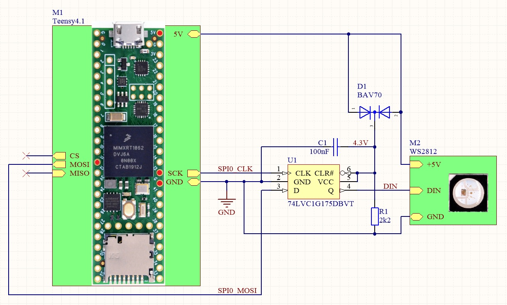

# WS2812
WS2812 driver for Teensy 4.x board

> :warning: Initial working version. 

The driver is completely written in micro Python, so it is theoretically possible to use it on any build without `NeoPixel` module. It uses SPI for "high speed" data transfer. But it requires a D-type flip-flop and SPI must support 12-bit transmission.

## Schematic diagram
SPI.MOSI (data) and SPI.SCK (clock) is connected to 74LVC1G175 (D-type flip-flop). Output (Q) drives WS2812.

Here is the recommended scheme:

Of course, another SPI bus can also be selected.

The U1 circuit can also be powered from the 3.3V source of the Teensy board and the result Q can be connected directly to the WS2812. It works. However, it should be taken into account that 3.3V is less than the defined minimum logic level Hi for WS2812 (3.5V @ Vdd=5V). 
For the final solution, it's better to have some way to ensure proper level transformation.
